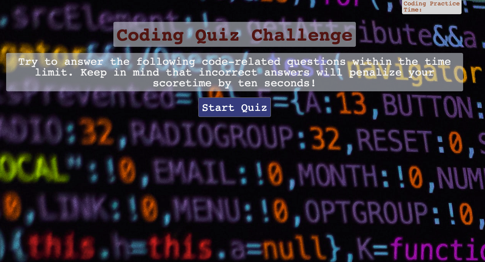
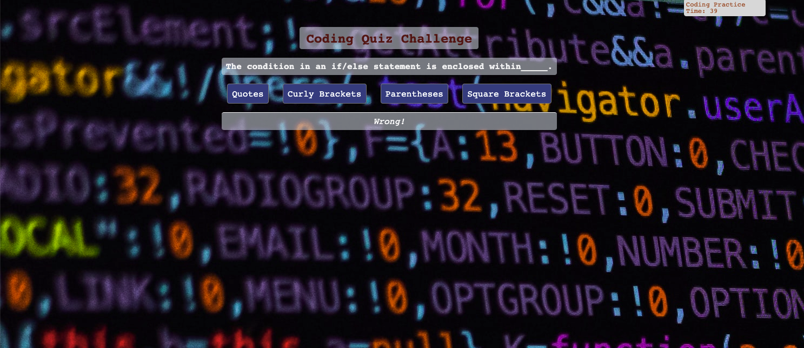
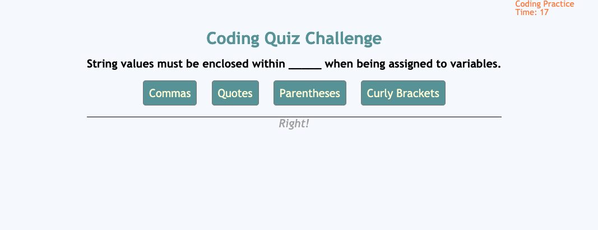
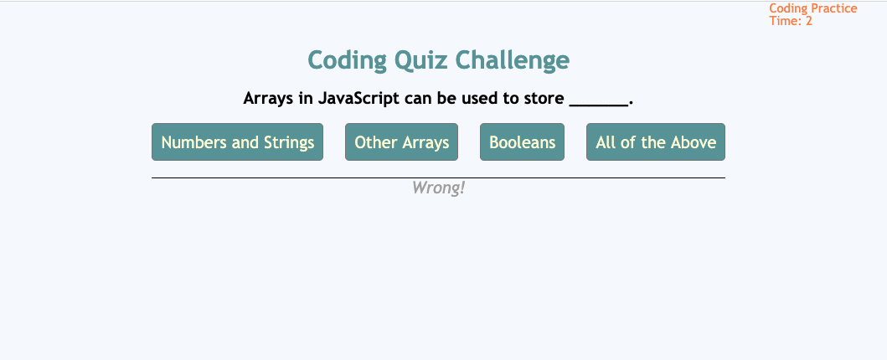
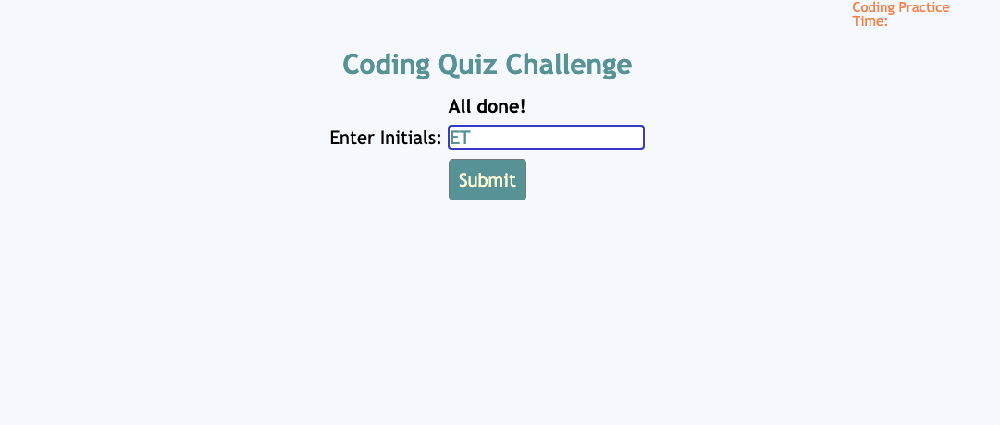
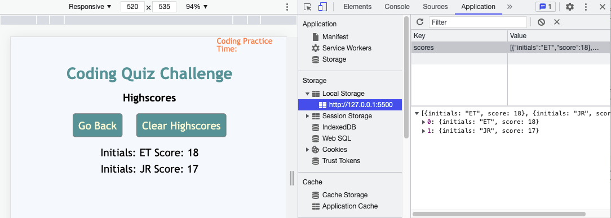

# Code_Quiz

## Description

- What was my motivation? I needed to create a "coding quiz" to apply and display my knowledge of timers and JavaScript.
- Why did I build this project? I built this project to better understand how to implement JavaScript code, particularly with reference to timers and navigating from one page to the next using buttons.
- What problem does it solve? This project presents a nice format for a quick quiz.
- What did I learn? I learned about timers, "for" loops, and display functionality when using JavaScript and CSS.

## Table of Contents

- [Installation](#installation)
- [Usage](#usage)
- [Credits](#credits)
- [License](#license)
- [Links](#links)

## Installation

Although this is simply a webpage and no installation is necessary, there were certain criteria that had to be met in order to complete this project:

    User Story

    AS A coding boot camp student
    I WANT to take a timed quiz on JavaScript fundamentals that stores high scores
    SO THAT I can gauge my progress compared to my peers

    Acceptance Criteria

    GIVEN I am taking a code quiz
    WHEN I click the start button
    THEN a timer starts and I am presented with a question
    WHEN I answer a question
    THEN I am presented with another question
    WHEN I answer a question incorrectly
    THEN time is subtracted from the clock
    WHEN all questions are answered or the timer reaches 0
    THEN the game is over
    WHEN the game is over
    THEN I can save my initials and my score

### Mock-Up

The following gif shows the web application's appearance and functionality:

## Usage
Please see below for examples of this webpage, which demonstrate its functionality:

### Main Page

###  First Question

###  Second Question

###  Third Question

###  Fourth Question

###  Final Score Page

###  Clear Highscore Page

###  Local Storage Example

## Credits
- https://javascript.info/
- https://du.bootcampcontent.com/denver-coding-bootcamp/du-den-virt-fsf-pt-08-2021-u-c/-/tree/master/04-Week_Web-APIs/02-Homework
- https://coding-boot-camp.github.io/full-stack/github/professional-readme-guide

## License
© 2021 Trilogy Education Services, LLC, a 2U, Inc. brand. Confidential and Proprietary. All Rights Reserved.

## Links
[Live Link](https://carlincb.github.io/Code_Quiz/)

[GitHub Link](https://github.com/carlincb/Code_Quiz)