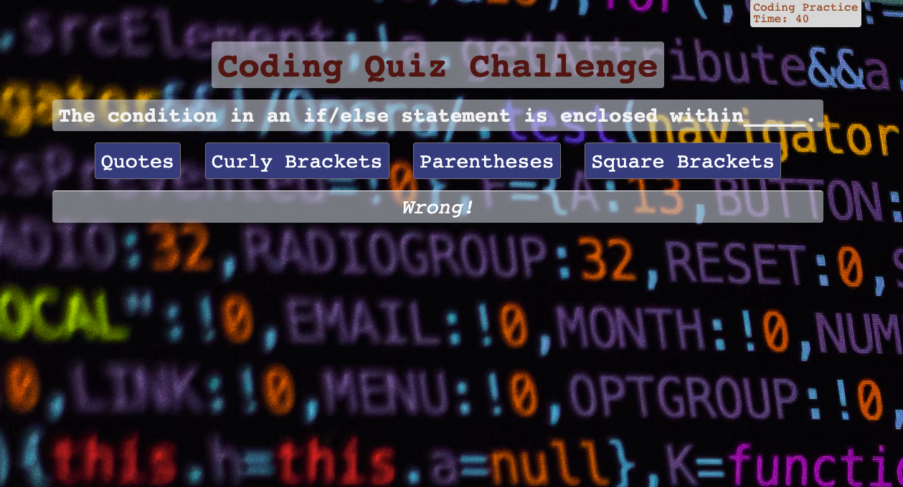
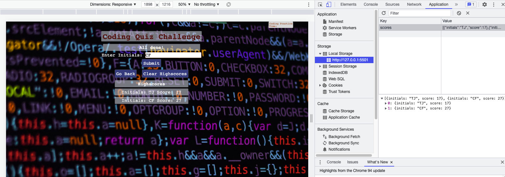

# Code_Quiz

## Description

- What was my motivation? I needed to create a "coding quiz" to apply and display my knowledge of timers and JavaScript.
- Why did I build this project? I built this project to better understand how to implement JavaScript code, particularly with reference to timers and navigating from one page to the next using buttons.
- What problem does it solve? This project presents a nice format for a quick quiz.
- What did I learn? I learned about timers, "for" loops, and display functionality when using JavaScript and CSS.

## Table of Contents

- [Installation](#installation)
- [Usage](#usage)
- [Credits](#credits)
- [License](#license)
- [Links](#links)

## Installation

Although this is simply a webpage and no installation is necessary, there were certain criteria that had to be met in order to complete this project:

    User Story

    AS A coding boot camp student
    I WANT to take a timed quiz on JavaScript fundamentals that stores high scores
    SO THAT I can gauge my progress compared to my peers

    Acceptance Criteria

    GIVEN I am taking a code quiz
    WHEN I click the start button
    THEN a timer starts and I am presented with a question
    WHEN I answer a question
    THEN I am presented with another question
    WHEN I answer a question incorrectly
    THEN time is subtracted from the clock
    WHEN all questions are answered or the timer reaches 0
    THEN the game is over
    WHEN the game is over
    THEN I can save my initials and my score

## Usage

Please see below for examples of this webpage, which demonstrate its functionality:

### Main Page

### Question

### Final Page with Local Storage

## Credits

- https://javascript.info/
- https://du.bootcampcontent.com/denver-coding-bootcamp/du-den-virt-fsf-pt-08-2021-u-c/-/tree/master/04-Week_Web-APIs/02-Homework
- https://coding-boot-camp.github.io/full-stack/github/professional-readme-guide
- https://unsplash.com/

## License

MIT License

Copyright (c) [2021] [Colleen Fimister]

Permission is hereby granted, free of charge, to any person obtaining a copy
of this software and associated documentation files (the "Software"), to deal
in the Software without restriction, including without limitation the rights
to use, copy, modify, merge, publish, distribute, sublicense, and/or sell
copies of the Software, and to permit persons to whom the Software is
furnished to do so, subject to the following conditions:

The above copyright notice and this permission notice shall be included in all
copies or substantial portions of the Software.

THE SOFTWARE IS PROVIDED "AS IS", WITHOUT WARRANTY OF ANY KIND, EXPRESS OR
IMPLIED, INCLUDING BUT NOT LIMITED TO THE WARRANTIES OF MERCHANTABILITY,
FITNESS FOR A PARTICULAR PURPOSE AND NONINFRINGEMENT. IN NO EVENT SHALL THE
AUTHORS OR COPYRIGHT HOLDERS BE LIABLE FOR ANY CLAIM, DAMAGES OR OTHER
LIABILITY, WHETHER IN AN ACTION OF CONTRACT, TORT OR OTHERWISE, ARISING FROM,
OUT OF OR IN CONNECTION WITH THE SOFTWARE OR THE USE OR OTHER DEALINGS IN THE
SOFTWARE.

## Links

[Live Link](https://carlincb.github.io/Code_Quiz/)

[GitHub Link](https://github.com/carlincb/Code_Quiz)
